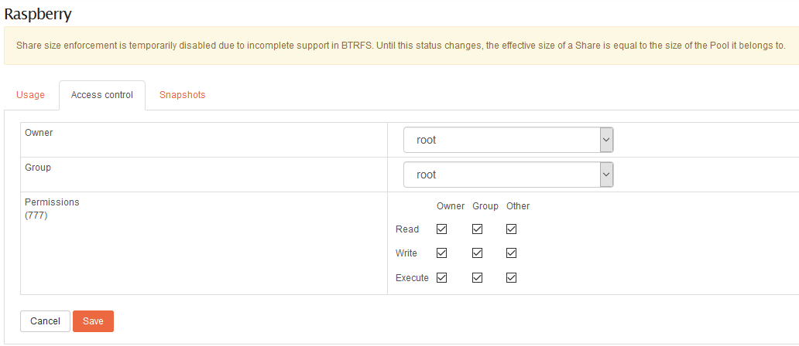
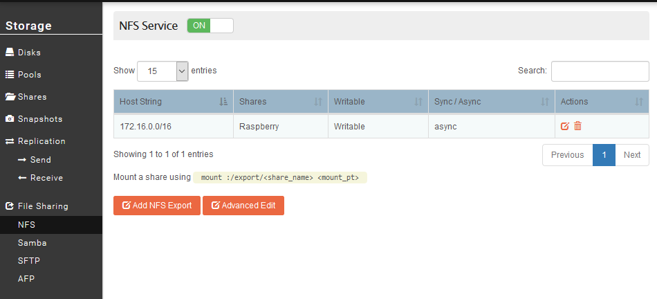
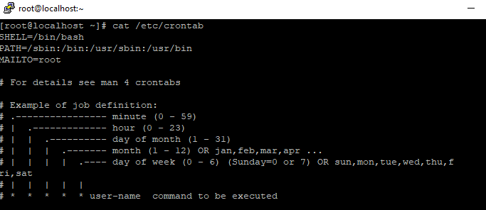
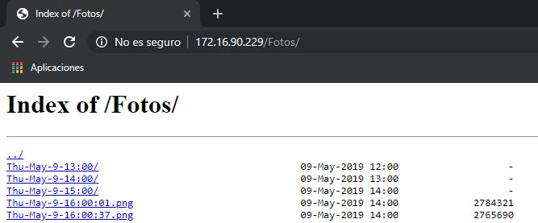
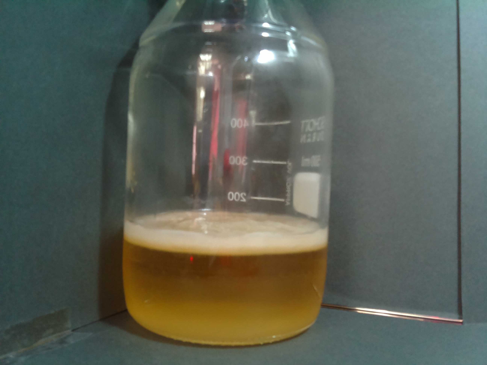

# Proyecto Celulosa

En el laboratorio del centro se pretende grabar la evolución de una bacteria relacionada con la Celulosa. Para ello el grupo de sistemas (Administración de Sistemas Informáticos en red) configurará una Raspberry pi con una cámara conectada para que tome dos fotos por minuto . El vaso que contiene la bacteria y la cámara se introducirán en un horno a una temperatura de 30ºC.


## Hardware

En este apartado vamos a dejar una tabla para exponer brevemente cual ha sido el material utilizado para llevar a cabo este proyecto.

|        Producto        |                            Precio                            |
| :--------------------: | :----------------------------------------------------------: |
|    Rasbperry pi 3b+    | [37,50€](https://www.pccomponentes.com/raspberry-pi-3-modelo-b) |
|    Tarjeta MicroSD     | [11,14€](https://www.pccomponentes.com/toshiba-exceria-m302-ea-16gb-uhs-i-clase-10-adaptador) |
| Fuente de alimentación | [9,39€](https://www.pccomponentes.com/fuente-de-alimentacion-para-raspberry-pi-3-51v-1-salida-25a-13w-negra) |
|  Cámara 5 megapíxeles  | [16,99€](https://www.amazon.es/Kuman-M%C3%B3dulo-Raspberry-Montajes-ajustables/dp/B06XNMMTTP/ref=sr_1_9?keywords=camara+raspberry+pi+3&qid=1557413206&s=gateway&sr=8-9) |
|       **TOTAL**        |                          **75,02€**                          |

!!! note
    Los precios de la tabla han sido consultados a fecha 09/05/2019.


## Puesta en marcha

Para el proyecto hemos utilizado como Sistema Operativo **CentOS minimal** que podemos descargarnos desde este [enlace](http://isoredirect.centos.org/altarch/7/isos/armhfp/). Por el momento únicamente tenemos disponible la versión de 32 bits, que será con la que trabajaremos en este proyecto. 

Puesto que la Raspberry pi 3b+ es un dispositivo utilizado en diferentes partes del proyecto, hay [otro apartado](Raspberry-Pi.md) en el que se explican las primeras configuraciones necesarias para su correcto funcionamiento. 

Los pasos que se exponen a continuación hacen referencia a este proyecto en particular, que será la puesta en marcha del **servidor** y **cliente NFS**, los **scripts** que hemos creado y la configuración de **Cron**.

### Nginx

Partimos de tener el servidor nginx instalado en nuestro sistema. Como pretendemos que las fotografías sean accesibles desde un navegador, en servidores nginx se debe hacer una modificación en el fichero `nginx.conf` que se encuentra en `/etc/nginx/nginx.conf` para que indexe el contenido. Además debemos ajustar la hora para que se ajuste a la hora local de la máquina.

 Debemos añadir los siguiente:

```bash
#El directorio Fotos será el que contendrá todas las fotografías que va capturan la raspberry. Hay que tener en cuenta que este directorio debe encontrarse en ""/usr/share/nginx/html/".
location /Fotos {
	autoindex on;
	autoindex_localtime on;
}
```

Fuente: [Linuxito.com](https://www.linuxito.com/gnu-linux/nivel-basico/1140-como-habilitar-el-listado-de-directorios-en-nginx)


### NFS Service

Haremos uso del NAS Rockstor como almacenamiento de las fotografías que se publicarán. Necesitamos almacenamiento externo puesto que obtendremos una fotografía cada treinta segundos, y el almacenamiento interno de la Raspberry pi (Tarjeta MicroSD de 16GB) no tiene capacidad suficiente para guardar las fotografías que vayamos a sacar durante los cuatro días que dura el proyecto.

Para acceder a este recurso de red utilizaremos el servicio **NFS**. En primer lugar al igual que hemos hecho en otras [ocasiones](Rockstor.md) para compartir recursos en samba, debemos crear un directorio compartido o **Share** (así lo denomina Rockstor).

Este recurso compartido que hemos creado, para que sea accesible desde nuestra Raspberry debemos modificar los permisos y otorgar lectura, escritura y ejecución a todos los usuarios.



!!! warning
    Estamos en un proyecto en una red local en la que no tenemos en cuenta la exposición del servidor NFS. Para más información sobre la seguridad en servidores NFS consultar el siguiente [enlace](https://web.mit.edu/rhel-doc/4/RH-DOCS/rhel-rg-es-4/s1-nfs-security.html).


Una vez que hemos creado un recurso para compartir, necesitamos habilitar el servicio NFS, encontraremos este servicio en *File Sharing* dentro de *Storage*.

La configuración debe de quedar del siguiente modo:




Ya tenemos configudo el servidor NFS en nuestro NAS Rockstor, por lo tanto pasamos a configurar el cliente en nuestra Raspberry pi. 

En primer lugar debemos instalar los paquetes necesario para que el cliente funcione correctamente. Los paquetes a instalar son:

1. nfs-common

2. portmap *(para la versión 4 de NFS no es necesario instalar este paquete, más información [aquí](http://web.mit.edu/rhel-doc/4/RH-DOCS/rhel-sg-es-4/s1-server-port.html))*

````bash
yum install nfs-common portmap
````

Una vez que tenemos el cliente instalado procedemos a describir los pasos necesarios para montar el recurso en nuestra Rpi.

- Comprobar que recursos se encuentran disponibles con el comando `showmount`:

````bash
showmount -e 172.16.43.226
````

- Montaje del recurso en la ruta que corresponde. En nuestro hemos montado el recurso en el directorio que utiliza nginx para almacenar el contenido que sirve, es decir en el directorio `/usr/share/nginx/html`:

````bash
mount -t nfs ip_del_servidor:/ruta_recurso_compartido /ruta_montaje
````

- Para terminar, configuraremos el recurso para que sea montado al inicio del sistema. Para ello es necesario configurar el fichero `/etc/fstab`:

````bash
172.16.90.230:/export/Raspberry /usr/share/nginx/html nfs defaults 0 0
````

​		Los parámetros descritos en el fichero **fstab** son los siguientes:

- **Defaults**: asigna las opciones de montaje predeterminadas. Estas opciones son: `rw`, `suid`, `dev`, `exec`, `auto`, `nouser`y `async`.
- **Dump**: indica si es necesario realizar una copia de seguirdad del sistema de ficheros. Puesto que no tenemos dump instalado en nuestro sistema debemos establecer 0.
- **Pass**: utilizado por [fsck](https://wiki.archlinux.org/index.php/Fsck) para decidir el orden de comprobación de los sistemas de ficheros. No queremos que realice ninguna comprobación por lo que le indicamos 0.

Fuente: [Wiki Archlinux](https://wiki.archlinux.org/index.php/Fstab)


## Scripts

En este apartado explicaremos los scripts que se han realizado para diferentes trabajos que queremos que realice la Raspberry.

- Este primer script tomará una fotografía cada **30 segundos**. Utilizaremos cron para que ejecute dicho script cada minuto, por lo tanto obtendremos fotografías cada 30 segundos.

````bash
#!/bin/bash

#Establecemos el nombre que daremos al documento.
FECHA=$(date | tr -s ' ' '-' | cut -d '-' -f 1-4)

#Ejecutamos el comando para tomar la fotografía.
raspistill -o /usr/share/nginx/html/Fotos/$FECHA.jpg

#Pausamos el script durante 30 segundos.
sleep 30s

#Volvemos a generar la variable, si no tomaría el mismo nombre que el fichero anterior.
FECHA=$(date | tr -s ' ' '-' | cut -d '-' -f 1-4)

#Ejecutamos de nuevo el comando para tomar la fotografía.
raspistill -o /usr/share/nginx/html/Fotos/$FECHA.jpg
````

- En este segundo script lo que pretendemos es almacenar las fotografías que se realizan durante una hora en un directorio. 

  Este directorio tomará como nombre la fecha y hora de las fotografías que se realicen durante una hora completa. Es decir las fotografías que se realicen entre las 17:00 y las 18:00 se almacenarán en un directorio con el nombre Wed-May-8-17:00/.

````bash
#!/bin/bash

for i in /usr/share/nginx/html/Fotos/*.jpg
do
	DIRECTORY=$(basename $i | tr -s ':' '-' | cut -d '-' -f 1-4)\:00
	
	if [ ! -d /usr/share/nginx/html/Fotos/$DIRECTORY ] ; then
		mkdir /usr/share/nginx/html/Fotos/$DIRECTORY
		mv $i /usr/share/nginx/html/Fotos/$DIRECTORY/
	else
		mv $i /usr/share/nginx/html/Fotos/$DIRECTORY/
	fi
done
````

- Por último, este script tiene una función similar al anterior. Lo que pretendemos es que todos los directorios que se hayan creado durante un día se almacenen en otro que llevará como nombre la fecha (sin hora). 

  Siguiendo con el ejemplo del script anterior, todos los directorios que se hubiesen creado durante ese día se almacenaría en otro con el nombre Wed-May-8.

````bash
#!/bin/bash

for i in /usr/share/nginx/html/Fotos/*00
do
	DIRECTORY=$(basename $i | tr -s ':' '-' | cut -d '-' -f 1-3)
	
	if [ ! -d /usr/share/nginx/html/Fotos/$DIRECTORY ] ; then
		mkdir /usr/share/nginx/html/Fotos/$DIRECTORY
		mv $i /usr/share/nginx/html/Fotos/$DIRECTORY/
	else
		mv $i /usr/share/nginx/html/Fotos/$DIRECTORY
	fi
done
````


## Cron

Para que los **scripts** que hemos creado en el apartado anterior se ejecuten automáticamente en el horario que nosotros decidamos es necesario hacer uso de el servicio **cron**. Su uso es muy sencillo, únicamente es necesario conocer la sintaxis, que podemos consultarla en el fichero `/etc/crontab`.



Para modificar el fichero que lee el servicio cron debemos ejecutar `crontab -e`, el cual abrirá el editor de texto **vi** para insertar las líneas que deseemos. En nuestro caso insertaremos tres líneas, una por cada script que deseamos ejecutar.

````bash
#Ejecución cada minuto
*/1 * * * * /root/fotos.sh
#Ejecución una vez cada hora
@hourly /root/mover.sh
#Ejecución una vez al día
@daily /root/moverdirectorios.sh
````

En la siguiente tabla extraída de la  [wiki](https://help.ubuntu.com/community/CronHowto) de Ubuntu podemos ver otra forma de sintaxis más reducida.

| **Cadena** | **Significado**                            |
| ---------- | ------------------------------------------ |
| @reboot    | Se ejecuta una vez, al inicio del sistema. |
| @yearly    | Se ejecuta una vez al año "0 0 1 1 *"      |
| @annually  | Igual que @yearly.                         |
| @monthly   | Se ejecuta una vez al mes "0 0 1 * *".     |
| @weekly    | Se ejecuta una vez por semana "0 0 * * 0". |
| @daily     | Se ejecuta una vez al día "0 0 * * *".     |
| @midnight  | Igual que @daily.                          |
| @hourly    | Se ejecuta una vez por hora "0 * * * *".   |


## Resultado final

El **resultado final** es el siguiente:






## Enlaces de interés

[How to Setup NFS](https://www.tecmint.com/how-to-setup-nfs-server-in-linux/)

[Raspistill](https://www.raspberrypi.org/documentation/usage/camera/raspicam/raspistill.md)


----

