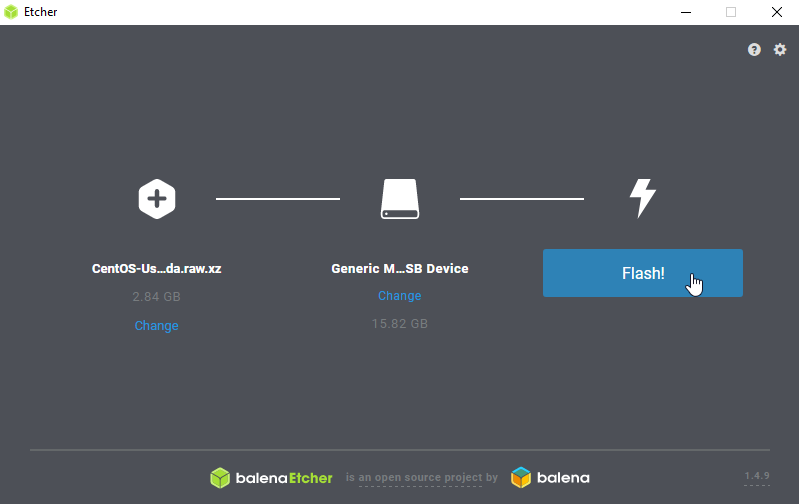
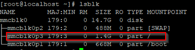
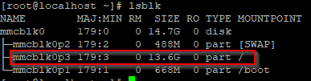
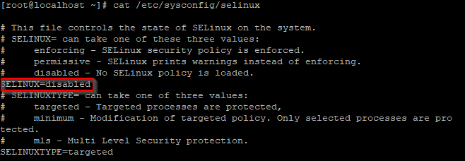
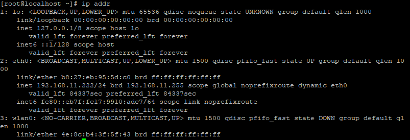
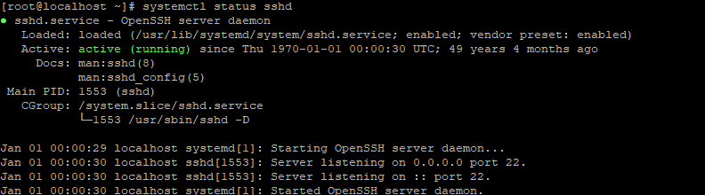
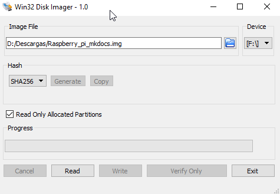

# Raspberry Pi

## Preparación

Para poder hacer uso de una Raspberry Pi como si de un ordenador se tratase, necesitamos 

instalar un Sistema Operativo en una tarjeta MicroSD.

**¿Cómo ser realiza esto?**

Necesitamos conectar una tarjeta MicroSD a un ordenador, para ello probablemente será necesario un lector de tarjetas con conexión USB (en caso de que tu equipo tenga lector de tarjetas no lo necesitarás), un dispositivo como [este](https://www.amazon.es/UGREEN-Tarjetas-Velocidad-Portatil-simult%C3%A1nea/dp/B0779V61XB/ref=sr_1_10?__mk_es_ES=%C3%85M%C3%85%C5%BD%C3%95%C3%91&keywords=lector+de+tarjetas+sd&qid=1557599567&s=gateway&sr=8-10).


Una vez que tenemos la tarjeta MicroSD y el lector de tarjetas, procedemos a realizar la instalación del Sistema Operativo que deseemos. En nuestro caso hemos seleccionado **CentOS**, de la familia **Red Hat**, puesto que es el que hemos estudiado durante el curso.

El microprocesador con el que cuenta la Raspberry Pi 3b es de la familia **ARM** con arquitectura de **64 bits**. Esto es necesario tenerlo en cuenta a la hora de seleccionar la imagen correcta. 

Teniendo en cuenta esto, acudiremos a la web oficial del Sistema Operativo que vayamos a instalar, y buscaremos la imagen compatible, que habitualmente está renombrada con el nombre del dispositivo, es decir, _**imagen para Raspberry pi 3**_.

Después de navegar por la web de CentOS hemos encontrado el [repositorio](http://isoredirect.centos.org/altarch/7/isos/armhfp/CentOS-Userland-7-armv7hl-RaspberryPI-Minimal-1810-sda.raw.xz) donde se encuentran las imágenes compatibles. A pesar de que la Raspberry Pi 3 cuenta con la arquitectura de 64 bits, por el momento CentOS cuenta únicamente con una versión de **32 bits** que es **compatible** con la Raspberry Pi 3.

Una vez que tenemos la imagen descargada en nuestro equipo, procedemos a instalarla en la tarjeta MicroSD, para ello utilizaremos un programa muy sencillo y que funciona muy bien, [balenaEtcher](https://www.balena.io/etcher/).



El proceso durará aproximadamente 5 minutos, una vez que haya terminado ya tendremos preparada la tarjeta MicroSD para introducirla en la Raspberry y empezar a trabajar sobre ella.


## Configuración de CentOS

### Expandir partición root

Vamos a comprobar las particiones que nos crea el Sistema Operativo una vez instalado con el comando `lsblk`, y como podremos comprobar en la siguiente imagen, la mayor parte del espacio de la tarjeta MicroSD no se está aprovechando.



Debemos expandir la partición correspondiente a root (**/**), la que aparece marcada en la imagen anterior. Siguiendo las instrucciones que aparecen en la [wiki de CentOS](https://wiki.centos.org/SpecialInterestGroup/AltArch/armhfp#head-bc44c21856f2c9f01844f24caa063221285256bc), debemos ejecutar el siguiente comando:

````bash
/usr/bin/rootfs-expand
````




### Deshabilitar selinux:

Es un módulo de seguridad que viene incluido en el Kernel de Linux. Durante el tiempo que hemos estado realizando pruebas nos ha dado bastantes problemas con el servidor web, con lo que hemos decidido deshabilitarlo. Para el control de seguridad haremos uso de la herramienta **Firewalld**.

Para deshabilitarlos debemos abrir el fichero `/etc/sysconfig/selinux` con cualquier editor de texto que tengamos instalado (por defecto viene instalado el editor **vi**).



Se ha modificado la línea que está marcada en rojo en la captura superior, ha pasado de enforcing a **disabled**. Para que los cambios resulten efectivos es necesario el reinicio completo de la Raspberry ejecutando el comando `reboot`. Esto es debido a que este modulo como hemos comentado es parte del kernel del sistema. 

!!! warning
	No se recomiendo deshabilitar el módulo Selinux. En este caso se trata de un entorno de pruebas, por lo que para que resulte más sencillo la puesta en marcha de varios servicios se ha procedido a deshabilitarlo.


### Configuración de red

Si tenemos un servidor **DHCP** en nuestra red local, este le asignará una dirección ip disponible a la Raspberry Pi. Para consultar la dirección ip que tiene nuestra Raspberry Pi debemos ejecutar `ip addr`.



Además con este comando podemos identificar el nombre que asigna el sistema a nuestra interfaz física.

Las tareas que realizaremos durante el curso con la Raspberry Pi nos obligarán a conectarnos constantemente a ella, por lo tanto sería recomendable disponer de una dirección ip que no cambie continuamente. 

Para ello vamos a asignarle una dirección ip disponible de forma manual para que sea estática. Modificaremos el fichero `/etc/sysconfig/network-scripts/ifcfg-eth0`, donde la última parte del nombre del fichero debe corresponder al nombre de la interfaz física.

````bash
DEVICE=eht0
BOOTPROTO=static
ONBOOT=yes
IPADDR=192.168.1.199
NETMASK=255.255.255.0
GATEWAY=192.168.1.254
DNS1=192.168.1.254
DNS2=1.1.1.1
````


## Actualizar Rasbperry Pi

Actualizaremos todos los paquetes disponibles, para ello ejecutaremos el siguiente comando:

````bash
yum update
````


## Conexión con la Raspberry Pi

Para trabajar de una forma más cómoda con la Rasperry Pi nos conectaremos remotamente, para ello utilizaremos el servidor OpenSSH. En la imagen de CentOS viene por defecto activado, pero lo comprobaremos ejecutando `systemctl status sshd`.



Como vemos, el servidor está activo con lo que para conectarnos remotamente podremos utilizar cualquier cliente ssh. Para Windows disponemos de varias herramientas como [MobaXterm](https://mobaxterm.mobatek.net/) y [Putty](https://www.putty.org/) entre otras, y para sistemas como Linux o MacOS podremos utilizar la propia terminal.

```bash
#usuario@dirección_ip_máquina_remota
ssh root@192.168.1.199
```

No hemos realizado ninguna modificación en el fichero de configuración `sshd_config` del servidor ssh. Para ampliar más información sobre la securización del servidor acudir a este  [enlace](https://www.ssh.com/ssh/sshd_config/).


## Firewall

**FirewallD** es un frontend de iptables, en las últimas versiones de CentOS reemplaza a iptables como herramienta de control de firewall por defecto. El funcionamiento es diferente puesto que FirewallD se basa en el concepto de zonas y servicios en lugar de cadenas y reglas.

Las zonas hacen referencia a un conjunto de reglas predeterminadas que en función de la zona seleccionada se aplican diferentes niveles de seguridad, se permite o bloquea diferente tipo de tráfico. Cuando activamos FirewallD se establece la zona **pública** como zona predeterminada.

El comando utilizado para la administración es `firewall-cmd`. Comandos que nos resultarán interesantes:

```bash
#Verificar el estado del firewall
sudo firewall-cmd --state

#Verificar la zona por defecto del firewall
sudo firewall-cmd --get-default-zone

#Listar todas las zonas disponibles
sudo firewall-cmd --get-zones

#Comprobar que zonas está utilizando nuestra interfaz
sudo firewall-cmd --get-active-zones

#Mostrar la configuración de una zona
sudo firewall-cmd --zone=public --list-all

#Cambiar la zona a una interfaz, con el siguiente comando asignamos la interfaz "eth0" a la zona "work"
sudo firewall-cmd --zone=work --change-interface=eht0
```


Cuando realizamos cambios en firewalld, si queremos que estos cambios sean persistentes es necesario hacer uso del flag `--permanent` , si no únicamente se mantendrán durante la sesión actual. Estos cambios no afectan al sistema en ejecución por lo que será necesario recargar el servicio con un comando específico.

Sabemos que en posteriores sesiones montaremos varios servidores web, por lo tanto configuraremos el firewall para que acepte peticiones **http** y **https**.

```bash
#Habilitamos el servicio "http" en la zona "pública", y además lo hacemos persistente.
firewall-cmd --zone=public --permanent --add-service=http

#Igual que el comando anterior pero para el servicio "https".
firewall-cmd --zone=public --permanent --add-service=https

#Reiniciamos el servicio.
firewall-cmd --reload
```


## Copia de seguridad

Una vez que tenemos configurada la Rasperry Pi es importante realizar un bakcup, ya que es muy habitual que la tarjetas MicroSD utilizadas en estos dispositivos dejen de funcionar.

Puesto que estamos trabajando con un equipo Windows, vamos utilizar la herramienta [Win32DiskImager](https://sourceforge.net/projects/win32diskimager/files/latest/download) para crear una imagen de la tarjeta MicroSD de nuestra Raspberry Pi.

El funcionamiento de esta aplicación es muy sencillo, una vez abierto el programa debemos seleccionar el directorio donde queremos guardar la imagen y el dispositivo origen de la misma (en este caso será la Raspberry Pi que Windows la ha montado en la unidad F:\\).

Seleccionaremos la opción **Read Only Allocated Partitions** en caso de que no se haya seleccionado automáticamente, y pulsaremos **Read**.




## Fuentes

[CentOS Linux on the Raspberry Pi 3](https://wiki.centos.org/SpecialInterestGroup/AltArch/Arm32/RaspberryPi3)

[Special Interest Group - Armhfp](https://wiki.centos.org/SpecialInterestGroup/AltArch/armhfp)

[Man page for firewall-cmd](https://www.unix.com/man-page/centos/1/firewall-cmd/)

[Introducción a FirewallD en CentOS](https://docs.bluehosting.cl/tutoriales/servidores/introduccion-a-firewalld-en-centos.html)

[How to set up a Firewall with FirewallD on CentOS 7](https://linuxize.com/post/how-to-setup-a-firewall-with-firewalld-on-centos-7/)

[Firewalld.org](https://firewalld.org/)

[Using CentOS 7 Minimal](https://github.com/rharmonson/richtech/wiki/Using-CentOS-7.2.1511-Minimal-on-the-Raspberry-PI-3)


----

