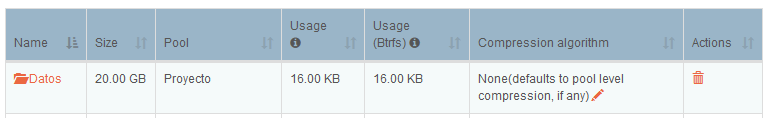

# Rockstor

## Introducción

Rocsktor es el sistema operativo que utilizaremos en nuestro NAS. Está basado en la distribución de Linux CentOS, adaptada para una configuración sencilla desde un navegador web.

Entre una de sus principales características, utiliza como sistema de ficheros [BTRFS](https://es.wikipedia.org/wiki/Btrfs) (integrado en el Kernel de Linux), lo que permite tener una serie de beneficios, tales como **copy-on-write**, respecto a otro tipo de sistema de ficheros como ext4. 

En el siguiente [enlace](http://rockstor.com/docs/intro.html#features) podemos encontrar un resumen de las principales características de este sistema operativo.

## Instalación

Para proceder a la instalación es necesario consultar los requisitos mínimos de hardware que necesitaremos. En la propia web de Rockstor podemos consultar estos [datos](http://rockstor.com/docs/quickstart.html#minimum-system-requirements). En la siguiente tabla exponemos una comparativa de los requisitos mínimos y el equipamiento introducido.

| Requisitos mínimos                | NAS Rockstar                         |
| --------------------------------- | ------------------------------------ |
| 64-bit Intel o AMD                | 64-bit AMD                           |
| 2GB RAM                           | 4GB RAM                              |
| 8GB espacio para el SO            | 80GB espacio para el SO              |
| 1 disco extra para almacenamiento | 1 disco de 250GB para almacenamiento |

Los pasos para la instalación del mismo son realmente sencillos. Al igual que sucede con cualquier sistema operativo, necesitamos crear una unidad *booteable* (DVD, USB, etc.), utilizando las herramientas disponibles en Windows, Linux o MacOS. 

Una vez que tenemos preparada la unidad *booteable*, pincharemos dicha unidad a nuestro NAS y en la BIOS seleccionaremos como unidad de arranque principal el dispositivo que hayamos preparado como unidad de arranque.

## Almacenamiento

En nuestra instalación contamos con dos discos:

- Un disco para el SO de 80GB
- Un disco de 250GB para datos (todos los datos )

Rockstor trabaja con el disco en crudo, es decir debemos entregarle el disco sin particiones. En caso de que tengamos alguna partición en alguno de los discos que hemos añadido al NAS tendremos posibilidad de eliminar dichas particiones a través de la interfaz web.

En este sistema, lo que entendemos habitualmente como particiones en este caso serán *pools*, que nos permite combinar diferentes discos (RAIDs)  como si fuese un único volumen.

Nuestra elección al contar únicamente con una unidad para almacenamiento de datos, ha sido la creación de un pool *"simple"* con toda la capacidad del disco. La interfaz nos permite aplicar diferentes configuraciones, como la compresión u opciones de "montado" de la unidad, aunque nosotros hemos mantenido las opciones por defecto.

## Shares

Una vez que tenemos el pool creado, pasamos a crear **_shares_** (podemos entenderlos como directorios). La creación de estos directorios es muy sencilla, en el momento que nos encontramos del proyecto contamos con dos directorios, que son los siguientes:

- Datos: directorio que utilizaremos para dejar capturas y toda la información referente al proyecto.
- Imágenes: directorio donde almacenaremos la imágenes (backups) de los equipos.

## Samba

La principal función de un NAS es tener datos de una forma centralizada y poder acceder a ellos a través de la red. Para ello es necesario tener algún servicio orientado a la transferencia de archivos como puede ser FTP, SMB o NFS (Rockstor dispone de estos tres servicios preinstalados). 

Hemos seleccionado SMB por ser un protocolo extendido y por su compatibilidad con los diferentes Sistemas Operativos. Tal y como hemos comentado este servicio viene preinstalado, pero no activado, por lo tanto es necesario acudir al menú **_servicies_** para habilitarlo.

Una vez que tenemos el servicio activado, necesitamos crear un *samba export*, así lo denomina Rockstor, pero es simplemente una unidad compartida a través de SMB. Para continuar con el apartado anterior, crearemos las unidades en base a los directorios **datos** e **imagenes**.

La creación es muy sencilla, una vez que estamos en la pestaña de "Samba", tenemos que pulsar el siguiente botón, , el cual nos llevará a la siguiente ventana:

 

Los parámetros que debemos considerar son los siguientes:

- **Shares to export**: aquí seleccionamos el directorio que queremos compartir.
- **Admin users**: elección de los usuarios con permisos de acceso.
- **Browseable**: permitir que el recurso compartido se muestre visible.
- **Guest ok**: permisos para invitados.
- **Read only**: recurso de sólo lectura.

Tal y como vemos, podemos personalizar la configuración añadiendo más directivas en **custom configuration**. En [este enlace](https://web.mit.edu/rhel-doc/4/RH-DOCS/rhel-rg-es-4/ch-samba.html) podemos obtener más información sobre los parámetros de configuración de samba.

Los directorios compartidos con los que nos encontramos son los siguientes:

----

