# Easy2boot

## Introducción

Durante el desarrollo del proyecto hemos necesitado instalar diferentes sistemas operativos y arrancar equipos con herramientas *booteables*. Para ello hemos utilizado una herramienta muy potente, llamada **Easy2boot**. 

Esta magnífica herramienta nos permite introducir en un único USB **ISOS** de diferentes sistemas operativos y herramientas como Hirens, GParted, etc. El límite será la capacidad de almacenamiento con la que cuenta nuestro USB. En este caso contamos con un USB de 32 GB, suficiente para tener varias ISOS de Windows y Linux, y además contar con alguna herramienta de las mencionadas anteriormente.

La creación de este USB multiboot es bastante sencilla, hay una guía en inglés bastante completa en su [página web](http://www.easy2boot.com). A pesar de ello, vamos a resumir el proceso que hemos seguido para crear este USB.

## Proceso de instalación Easy2boot

En primer lugar, necesitamos descargar el fichero **ejecutable** que se encuentra en la pestaña "Download" de su página web (enlace directo [aquí](http://files.easy2boot.com/200003509-5befd5ce8d/Easy2Boot_v1.A9.exe)). Una vez descargado, haciendo doble click sobre el archivo, lo ejecutaremos y procederá la instalación del mismo. 

Durante la instalación nos solicitará donde queremos guardar el directorio **master**, este es el directorio que contiene todas las herramientas que nos proporciona Easy2boot.

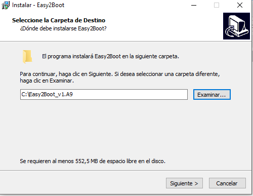

El directorio que nos crea lo podemos utilizar para dejar todas las ISOS para crear tantos USB como queramos como veremos más adelante. Dentro del directorio nos podemos encontrar los siguientes ficheros:

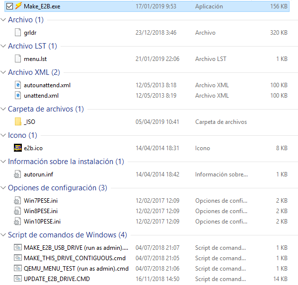

El único directorio que nos encontramos dentro de Easy2boot es el llamado **_ISO** que es donde se almacenarán todas nuestras imágenes. Como veremos a continuación, estas imágenes estarán agrupadas en subdirectorios, que corresponderán a la temática de cada iso. Esto es útil ya que el menú que nos muestra cuando arranquemos con el USB mostrará los subdirectorios que tengamos creados. 

Veamos los diferentes directorios que nos encontramos:

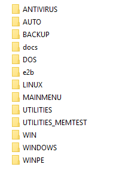

## ISOs de Sistemas Operativos (UEFI-BIOS)

Desde hace unos pocos años contamos con el denominado sistema UEFI, que es la versión que sustituye a la conocida BIOS. Para no entrar en detalles técnicos, dejamos un enlace a un medio inglés donde explican los beneficios que aporta UEFI respecto a BIOS [UEFI, BIOS, GPT, MBR – What’s the Difference?](https://fossbytes.com/uefi-bios-gpt-mbr-whats-difference/). 

Por este motivo, y para aprovechar esta característica en los equipos más modernos, debemos tener en cuenta realizar instalaciones que nos permitan la compatibilidad con el modo UEFI. Es necesario modificar el fichero ISO con una herramienta que nos proporciona Easy2boot [MPI tool kit](http://files.easy2boot.com/200003517-2f08c2ffe0/MPI_Tool_Pack_Plus_CloverLite_092.zip). 

Además de modificar las isos de los sistemas operativos, hay que modificar algún autoarrancable como el de Hirens. A continuación veremos los pasos necesarios para llevar a cabo la *transformación* de las imágenes de los sistemas operativos.

1. Una vez descargada la herramienta que hemos mencionado, debemos descomprimirla. Nos encontraremos dentro del directorio descomprimido con lo siguiente:

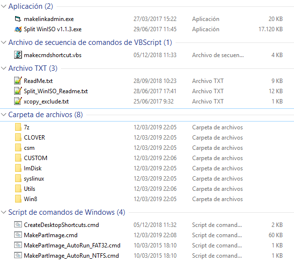

2. El siguiente paso será ir al directorio **ImDisk** y ejecutar el fichero **imdiskinst.exe**.

   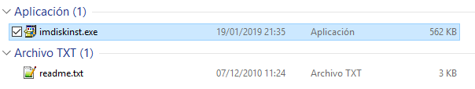

3. Para facilitarnos el trabajo, crearemos varios accesos directos en el escritorio ejecutando el script que tenemos en el directorio principal de MPI toolkit. Este script se llama **CreateDesktopShortcuts.cmd**.

   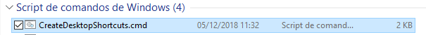

4. A continuación veremos que los accesos directos se habrán creado directamente en nuestro escritorio.

   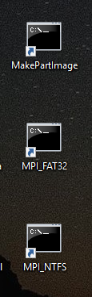

5. El último paso será la creación de la imagen con extensión **.imgPTN**. Para ello, en el directorio donde tengamos las diferentes ISOS de los sistemas operativos, arrastraremos estas imágenes al acceso directo creado en el escritorio, denominado **MPI_FAT32** que será la herramienta que hará compatible nuestra imagen. Se abrirá una ventana d

6. Una vez creada la nueva imagen, la veremos en el mismo directorio donde se encuentra la "original".

   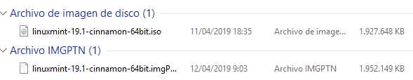

Surge un problema, y es que FAT32 no soporta ficheros de más de 4GB, y tanto la versión de Windows 8 de 64 bits como Windows 10 (32 y 64 bits) tienen un tamaño superior a 4GB. Para solucionar esto, Easy2boot nos proporciona varias opciones, que podemos encontrar en [este enlace](http://www.easy2boot.com/add-payload-files/adding-windows-install-isos-without-needing-a-helper-flash-drive).

Tal y como recomiendan en la web, se utilizará el método 1. Dentro del directorio **MPI Tool Kit** nos encontramos con una herramienta llamada **Win split winiso** muy fácil de utilizar. Bastará con ejecutarla, seleccionar la iso que tenga un tamaño superior a 4GB, establecer en 4000 en la opción **Split Size** y pulsar en convertir, tal y como vemos en la siguiente captura.

## Volcado USB

Una vez que tenemos preparado el directorio de Easy2boot con todos los pasos realizados anteriormente, procedemos a crear el Multiboot USB. Los pasos a seguir que veremos a continuación son muy sencillos.

1. Procedemos a ejecutar como administrador el script **MAKE_E2B_USB_DRIVE**.

   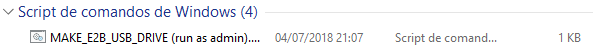

2. Se abrirá una consola como administrador donde deberemos seleccionar el USB que queremos utilizar para el Multiboot.

3. Una vez seleccionado el USB, seleccionaremos el tipo de formato de archivos. En este caso hemos seleccionado NTFS para que sea compatible con las ISO de Windows, ya que su tamaño supera los 4GB.

   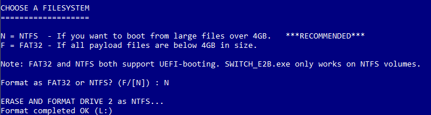

4. Por último, nos saldrá un aviso diciendo que el USB será formateado y que todos los ficheros que contiene serán eliminados. Aceptamos y procederá la creación del Multiboot. Dependiendo de la cantidad de ISOs tardará más o menos. 

## Últimos pasos

Un paso importante y que no debemos olvidar si queremos que nuestro USB funcione correctamente es *desfragmentar* la unidad con la herramienta que incorpora Easy2boot llamada **Make this drive contiguous**. 

Según lo que podemos leer en su web, en algunas ocasiones si no realizamos este paso es posible que nos salgan algunos *warning* cuando intentemos arrancar alguna ISO, por lo tanto para evitar dichos problemas ejecutaremos esta pequeña herramienta.

## ¿Qué contiene el USB?

### Herramientas:

**Antivirus:**

* Bitdefender rescue
* Kapersky

**Backup:**

* Acronis True Image (Versión 2015 y 2016)
* Clonezilla

**Otras herramientas:**

* GParted Live
* Systemrescue 
* Hirens Boot
* Recover password

### Sistemas Operativos:

**Windows:**

* Windows 7 profesional (Versión 32 y 64 bits)
* Windows 8.1 profesional (Versión 32 y 64 bits)
* Windows 10 Profesional (64 bits)
* Windows 10 Home (64 bits)

**Linux:**

* Linux Mint Cinnamon 19.1
* CentOS Minimal 7

## Consideraciones

* La preparación de este USB se puede realizar también en Linux.

* Los ficheros **.imgPTN** son compatibles tanto con MBR como con UEFI, por lo tanto todas las imágenes que tenemos (Linux y Windows) serán transformadas  para tener compatibilidad con ambos ficheros.

* Los archivos descargados contienen ficheros **Readme.txt**, muy interesantes si queremos ampliar información sobre esta herramienta.

* Existe la posibilidad de personalizar el USB que hemos creado. Para ellosEasy2boot ha incorporado una herramienta gráfica llamada **E2B_Editor** (es un fichero *.exe*) que nos permite realizar diferentes configuraciones, como cambiar la imagen de fondo, los colores del menú, las opciones y un largo etcétera.

  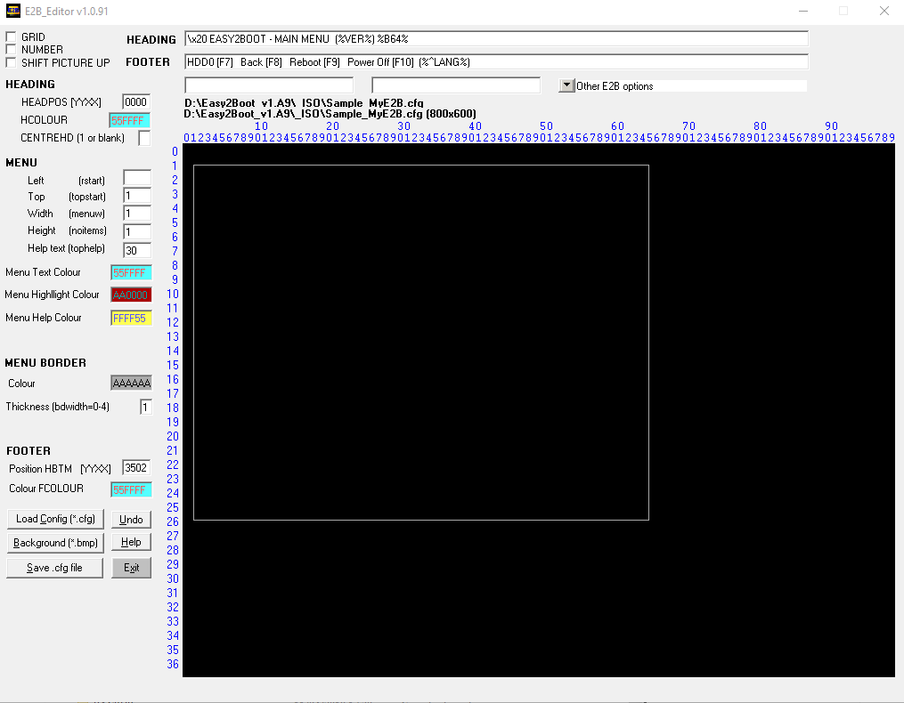

## Fuentes

[Easy2boot](http://www.easy2boot.com/)

----

