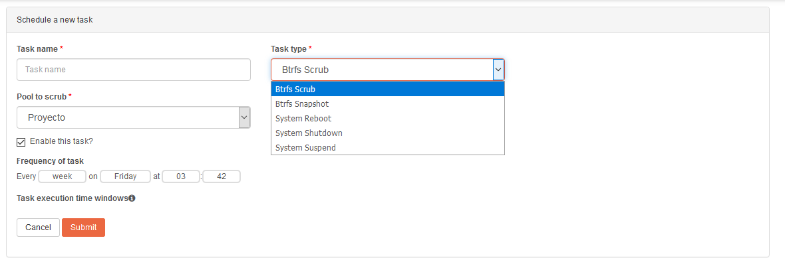

# Rclone

## ¿Qué es Rclone?

Es una herramienta muy potente para interactuar con servicios en la nube. Esta herramienta se utiliza desde la línea de comandos, y nos permite trabajar principalmente de tres modos diferentes.

- **Rclone sync:** para la **sincronización** hacía o desde los servicios en la nube. 
- **Rclone copy:** para el **copiado** hacía o desde los servicios en la nube. La diferencia respecto a **sync** es que a pesar de que se eliminen algunos ficheros, en el dispositivo cliente (donde hemos realizado la copia) esos fichero eliminados nos desaparecerán, puesto que no están sincronizados.
- **Rclone mount**: para el **montaje** de servicios en la nube en nuestro dispositivos. Tal y como realiza el comando **mount** en Linux, nos permite montar una unidad de los servicios en la nube compatibles, como si se tratase de un sistema de ficheros de nuestro dispositivo.

Hay una larga lista de servicios compatibles con esta herramienta, los podemos consultar en este [enlace](https://rclone.org/).


## Instalación:

Como ya se ha comentado, el Sistema Operativo Rockstor está más limitado que otros Sistemas orientados a NAS, en lo referente a Docker. Por lo tanto no podremos instalar esta herramienta como contenedor, por lo que haremos la instalación dentro del propio Sistema desde la línea de comandos.

La instalación es muy sencilla, en [esta web](https://rclone.org/install/) podemos ver la instalación tanto para Linux como para MacOS. Podemos optar por llamar a un script que realizará todo el proceso de instalación, o descargarnos un fichero *.zip* que descomprimiremos e instalaremos.

Un aspecto importante a tener en cuenta es que siguiendo la guía de instalación sobre Linux, no descarga la última versión. Para evitar esto, y descargar la última versión, iremos a este [enlace](https://rclone.org/downloads/) y copiaremos la dirección del fichero *.zip* que corresponde con nuestra máquina. 


Los siguientes puntos sobre como debemos instalar esta herramienta están **copiados** directamente desde la web de rclone. 

- Descarga del fichero *.zip* y descompresión.

```bash
curl -O https://downloads.rclone.org/v1.47.0/rclone-v1.47.0-linux-amd64.zip
unzip rclone-v1.47.0-linux-amd64.zip
cd rclone-v1.47.0-linux-amd64
```

!!! note
    La ruta que debemos poner es la que corresponde a la última versión de Rclone.


- Trasladar el binario *rclone*.

```bash
sudo cp rclone /usr/bin/
sudo chown root:root /usr/bin/rclone
sudo chmod 755 /usr/bin/rclone
```

!!! note
    La ruta /usr/bin se encuentra en el PATH, que es la variable que contiene las rutas a los directorios que contienen los ficheros ejecutables. De ese modo podremos ejecutar Rclone sin importar en que directorio del sistema nos encontremos.


- Añadiendo el manual de rclone a la base de datos de manuales.

```bash
sudo mkdir -p /usr/local/share/man/man1
sudo cp rclone.1 /usr/local/share/man/man1/
sudo mandb 
```

!!! note
    La herramienta unzip no se encuentra instalada, para instalarla es suficiente con ejecutar `yum install unzip`.
    Copiamos el manual y actualizamos la base de datos de los manuales para que podamos invocar el "man page" ejecutando `man rclone`.


## Configuración:

La configuración es muy sencilla ya que el propia sistema nos guía una vez que ejecutamos `rclone config`. Cuando ejecutamos este comando nos aparecerá un pequeño menú desde donde crearemos los nuevos servicios remotos.


La opción para crear es la "**n**", que una vez seleccionada esta opción nos aparecerá en el prompt para asignarle un nombre, y a continuación debemos elegir que servicio queremos configurar.


Hemos seleccionado Google Drive que es la opción número 12 (quizá pueda variar de el número si la versión de Rclone es diferente). Nos aparecerán una serie de parámetros para ir configurando, únicamente mostraré los que hemos necesitado configurar, puesto que el resto se han dejado por defecto ya que los valores por defecto eran suficientes tal y como indica la guía de rclone.

En uno de los pasos de la configuración debemos establecer los permisos que le otorgamos, para lo que necesitamos la opción número "1" es la más adecuada, siendo esta la más permisiva.


A continuación, si no queremos que rclone tenga acceso a todos los directorios que tenemos en nuestra cuenta de Google Drive, debemos especificar cual será el directorio root. La mejor forma de hacerlo es copiar y pegar la parte final de la url que nos aparece cuando estamos en el directorio que queremos que rclone tenga acceso. y 


Otra de las preguntas que nos aparecerán es si deseamos editar la configuración avanzada, para nuestro supuesto no es necesario, por lo que seleccionaremos "**n**".


La siguiente cuestión a tener en cuenta es si deseamos utilizar la configuración automática. Como podemos ver en la explicación, en el segundo punto nos indica que sí estamos trabajando en una máquina remota (por ejemplo contra nuestro servidor vía ssh) debemos seleccionar la opción "**n**", que será la opción que seleccionaremos.


Al haber pulsado la opción "**n**" nos mostrará una dirección que debemos copiar y pegar en nuestro navegador. Esta dirección nos solicitará autenticarnos con la cuenta de Google Drive que queremos vincular con Rclone.  Una vez que nos autentiquemos nos aparecerá un código que copiaremos y pegaremos en la línea que nos solicita Rclone.


Antes de finalizar, nos preguntará si deseamos configurar como un Team Drive [^1], no es nuestro caso por lo tanto seleccionaremos "**n**".


Nos mostrará un pequeño resumen con el "*remote*" que hemos configurado. Para finalizar debemos seleccionar con la letra "**q**" (Quit config).


## Opciones utilizadas:

Nuestro objetivo es sincronizar el directorio al que hemos dado acceso a rclone con un directorio que tenemos en nuestro NAS. Como ya hemos hablado en la primera parte, para la sincronización hemos utilizado el comando **rclone sync**. Para el correcto funcionamiento hemos hecho uso de varios parámetros/flags que se explicarán a continuación.

### Logging

Utilizaremos dos opciones para monitorizar rclone.

[-v, --verbose](https://rclone.org/docs/#v-vv-verbose): rclone tiene 4 niveles de log, *ERROR*, *AVISO*, *INFO* Y *DEBUG*. Cuando utilizamos `-v` , rclone muestra los tres primeros niveles de error.

[--log-file=FILE](https://rclone.org/docs/#log-file-file): en combinación con la anterior, todo el log monitorizado lo enviamos a un fichero, que será el que establecemos después del símbolo `=`.

### Bwlimit

[--bwlimit](https://rclone.org/docs/#bwlimit-bandwidth-spec): con está opción limitamos el ancho de banda. En nuestro caso la utilizaremos para no ocupar todo el ancho de banda que nos proporciona nuestro ISP. Por la web se puede ver limitaciones de **8650k** (Hace referencia a 8650 KBytes, que si hacemos la operación matemática correspondiente son aproximadamente 750GB diarios, que es el limite para los Team Drive *enlace más abajo*).

Según lo que se puede leer por algunas consultas realizadas al soporte de Google, no hay limitaciones, salvo en los que se refiere a contenido de video (Por ejemplo si queremos utilizar GD para almacén del contenido de Plex) y de hosting.

Limitaciones de Google:

- [Files you can store in Google Drive](https://support.google.com/drive/answer/37603?hl=es)
- [Team Drive Limits](https://support.google.com/a/answer/7338880?hl=en); *After you've uploaded 750 GB to a Team Drive in 1 day, you'll be blocked from uploading additional files that day. However, file uploads already in progress will complete, up to a 5 TB maximum for a single file.*

### Update

[-u, --update](https://rclone.org/docs/#u-update): con esta opción obligamos a rclone que omita cualquier archivo que tenga una hora de modificación más reciente en destino que en origen. Además, si el archivo tiene la misma hora de modificación en destino como en origen, sólo se actualizará si el tamaño es diferente.

### Tpslimit

[--tpslmit](https://rclone.org/docs/#tpslimit-float): debido a los baneos de las cuentas de google drive (los baneos son de 24 horas, que es el tiempo que tarde Google en refrescar las *estadísticas*, desconozco si los baneos son mayores si el baneo es reiterado). Según lo que he podido leer en varios grupos de telegram y por internet, la cifra más acertada es 8, que son el número de peticiones máximas por segundo que haríamos a la API de Google.

### Transfers

[--transfers](https://rclone.org/docs/#transfers-n): es el número de transferencias en paralelo que se realizan. Por defecto rclone establece 4 transferencias en paralelo. Puesto que me parece un número excesivamente bajo, y aprovechando el ancho de banda que le hemos dados, vamos a elevar el número a 15.

Estas son las opciones que hemos necesitado introducir para que la sincronización funcione correctamente. Lo que pretendemos es una sincronización y con la ejecución de **rclone sync** en una ocasión no conseguiremos la sincronización indefinida, la sincronización se completa cada vez que este comando se ejecuta, por lo tanto para facilitar esto haremos uso de dos pequeños scripts.

- **Script 1:**

````bash
#!/bin/bash
rclone sync ASIR: /sharedfolders/ASIRDrive -v --log-file=/home/Logs/rclonesync.txt -u --bwlimit 8650k --tpslimit 10 --transfers 15
exit
````

- **Script 2:**

````bash
#!/bin/bash
#Comprobamos que el script no se está ejecutando mediante pidof
if pidof -o %PPID -x sh /home/Scripts/rclonesync.sh; then
	exit 1
fi
#Después de comprobar, si no se está ejecutando pasará a ejecutar los siguientes comandos.
echo "Ejecutando rclonesync..."
#Puesto que la ruta de los scripts no se encuentra en la variable PATH es neceario indicarle la ruta completa. Esto ejecutará el "Script 1"
/home/Scripts/rclonesync.sh
echo "¡La ejecución del script ha finalizado!"
exit
````

!!! note
    La ruta que establecida después de sh puede diferir con la que utilicéis. Tenéis que indicar la ruta donde se encuentra vuestro script.


Una vez que hemos creado los Scripts en el directorio de Rclone que hayamos decidido, les daremos permiso de ejecución para que no sea necesario llamar al comando `sh` y con poner la ruta completa del script sea suficiente. Esto nos evitará algunos problemas que pueden surgir con el comando pidof.

```
chmod a+x /home/Scripts/*
```

- **a+x:** otorgamos permisos ejecución a todos los usuarios.
- **/home/Scripts/\*:** a todo el contenido que se encuentra en esta ruta. 

Ya tenemos los scripts que queremos ejecutar para controlar de una forma más sencilla la sincronización, pero nos falta configurar que el sistema ejecute estos scripts automáticamente. 

**¿Qué necesitamos?**

Como hemos hecho en otras ocasiones, haremos uso del programador de *trabajos* de Linux, es decir, de cron. Rockstor está limitado para crear tareas planificadas desde la interfaz web, únicamente nos permite crear varias tareas ya planificadas por el sistema, y no las nuestras propias.



Una vez más debemos hacer uso de la línea de comandos, utilizaremos el comando `crontab` para añadir la ejecución del **"Script 2"** cada **30 minutos**.

````bash
#Abrimos el editor de cron
crontab -e

#Añadimos la tarea
*/30 * * * * /home/Scripts/comprobar_rclonesync.sh

````

### Control de Logs

Por la web de Rclone no se menciona nada sobre el control del tamaño de los log que se van generando. Sería interesante poder eliminar los datos antiguos, es decir establecer un límite de por ejemplo 10MB y cuando llegue a ese límite que vaya eliminando logs antiguos para poder introducir nuevos logs.

Como digo, no he visto forma de hacerlo por lo tanto voy a añadir a **cron** un comando a ejecutar para que compruebe el tamaño de los logs y en caso de que supere el tamaño que nosotros le indiquemos (en nuestro caso serán 10MB) que realice una acción.

```bash
find /home/Logs/ -type f -size +10M -exec rm -f {} \;
```

- **find:** comando utilizado para realizar búsquedas.
- **/home/Logs/:** es la ruta en la que queremos buscar, podemos indicarle la que queramos. La ruta que he marcado es donde se encuentran los Logs de rclone.
- **-type f:** es el tipo de fichero que queremos buscar (en linux todo es un fichero), en nuestro caso será un fichero de tipo *file*.
- **-size +10M:** buscamos fichero mayor de 10 Megabytes. Si delante del 10 indicamos un `-` buscará ficheros menores a 10 Megabytes. Se puede establecer otras unidades de medida que se encuentran explicadas en el manual de find.
- **-exec:** nos permite ejecutar una acción con todo aquello que ha encontrado (en función de las condiciones que le hemos marcado).
- **rm -f:** rm = remove, es decir elimina lo que hemos encontrado, y como estamos seguros de que lo que ha encontrado lo queremos eliminar pasamos el parámetro *-f* para que no nos solicite confirmación.
- **{}:** identifica a todo lo que ha encontrado el comando find.
- **\;:** es la finalización del comando find cuando utilizamos la opción `-excec`.

[Man find](http://man7.org/linux/man-pages/man1/find.1.html)


## Otros comandos útiles:

- **Listremotes:** nos permite listar todos los *remotes* que hemos configurado.

````bash
rclone listremotes
````

- **List**: nos permite listar el contenido. Hay varios comandos que podemos ejecutar que nos mostrarán diferentes resultados.

````bash
#Lista los objetos que se encuentran en REMOTO.
rclone ls REMOTO:
#Lista los directorios que se encuentra en REMOTO con fecha y hora de creación.
rclone lsd REMOTO:
#Lista todo el contenido de la ruta que le indiques, tanto directorios como ficheros.
rclone lsf REMOTO:
#Lista todo el contenido (ficheros y directorios) incluido lo que se encuentra en todas las subcarpetas.
rclone lsl REMOTO:
````

- **Tree**: nos muestra un lista de todo el contenido en forma de árbol. *(No lo recomiendo utilizar ya que tarda bastante en ejecutarse)*.

````bash
rclone tree REMOTO:
````


- **Help:** nos permite ver diferentes comandos o flags que podemos introducir.

````bash
rclone --help
rclone help flags
rclone help backends
````

!!! note
    Donde aparece **REMOTO** es necesario sustituirlo por el nombre de la unidad que hayáis configurado.


### Enlaces interesantes:

- [¿Qué son las unidades de equipos (Team Drive)?](https://support.google.com/a/answer/7212025?hl=es&ref_topic=7337266)
- [Funcionamiento de logging en rclone](https://rclone.org/docs/#logging)
- [Más filtros de Rclone](https://techwiki.co.uk/RClone_-_Filtering)
- [Google OAuth “invalid_grant” nightmare — and how to fix it](https://blog.timekit.io/google-oauth-invalid-grant-nightmare-and-how-to-fix-it-9f4efaf1da35)
- [Rclone commands](https://rclone.org/commands/)


----

