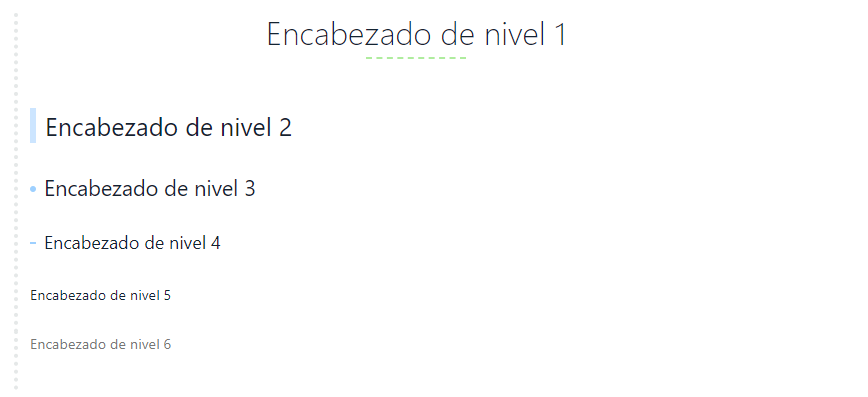

# Sintaxis Markdown

## Negrita y cursiva

Comenzando con la sintaxis Markdown, estoy siguiendo una pequeña guía que introduce la sintaxis más básica a utilizar. La guía en cuestión se encuentra pulsando [**aquÍ**](https://www.markdowntutorial.com/lesson/1/ "Tutorial de Markdown").

Para escribir en **negrita** utilizaremos los asteriscos ````**````, tanto al inicio como al final de la palabra o texto que queramos que aparezca en negrita. Un ejemplo:

```markdown
**Markdown**
```

Como comentaba, también es posible establecer en negrita un fragmento de texto completo: 

```markdown
**Esta es una frase en negrita**
```

Para redactar en _cursiva_ utilizaremos el guion bajo ````_````, tanto al inicio como al final, al igual que sucede con la negrita.

```markdown
_Markdown_
_Esta es una frase en cursiva_
```

También existe la posibilidad de combinar tanto **negrita** como _cursiva_. Ejemplo:

```markdown
_**Un ejemplo de combinar negrita y cursiva**_
```


## Los encabezados

La segunda parte de esta pequeña guía trata sobre los encabezados. Los encabezados nos ayudan a organizar el contenido mediante secciones.

En la sintaxis markdown tenemos seis niveles de encabezado, y todos ellos se identifican mediante la "almohadilla" ````#````. Es decir, el numero de "almohadillas" vendrá definido por el nivel de encabezado que queramos establecer. A continuación veremos un ejemplo:

```markdown
# Enacabezado de nivel 1
## Encabezado de nivel 2
### Encabezado de nivel 3
#### Encabezado de nivel 4
##### Encabezado de nivel 5
###### Encabezado de nivel 6
```

Hay que tener en cuenta, que dependiendo de la herramienta que estemos utilizando en nuestros equipos para redactar texto plano en formato markdown, los encabezados y otro tipo de sintaxis lo "decorará" en función al tema que estemos utilizando en dicha herramienta. 

En mi caso estoy utilizando actualmente la aplicación [**Typora**](https://typora.io/ "Typora") con el tema "Mystic". Podéis encontrar más temas pulsando [**aquí**](https://theme.typora.io/ "Temas Typora").




## Enlaces

En muchas ocasiones, podemos ver como en muchos blogs utilizan los enlaces para dirigirnos a otras secciones de la misma página web, o incluso a webs diferentes. Esto se utiliza mucho para permitir al lector profundizar en algún tema que se ha mencionado pero no se ha tratado al completo durante la lectura.

Para poder introducir una enlace "dentro" de una palabra o una porción de texto, es necesario seguir la siguiente sintaxis:

```markdown
Enlace a [google](https://www.google.es), donde google es el texto al que queremos introducir un enlace, que en este caso nos llevará a la página principal del buscado Google.
```

El resultado sería el siguiente: Enlace a [**google**](https://www.google.es "Google"). Como ya os habréis dado cuenta, en las anteriores secciones he introducido diferentes enlaces siguiendo ésta sintaxis. **Es importante tener en cuenta, que para enlaces externos debemos escribir también el protocolo utilizado (_https://, http://, ftp:///, etc._)**.

Una característica muy interesante y que nos ahorrará tiempo en función de los enlaces que sean idénticos, es la posibilidad de utilizar los "_reference link_". Esto nos permite utilizar en un documento una palabra o frase como enlace externo. A esta palabra o frase le especificamos el enlace externo (esto no se mostrará en nuestro documento Markdown) y de ese modo cuando queramos modificar dicho enlace externo sólo será necesario modificarlo en una ocasión. Lo veremos con un ejemplo para que quede lo más claro posible.

```markdown
Este enlace nos llevará a [google][primer enlace] y este otro también nos llevará a [google][primer enlace]. te otro enlace queremos que nos lleve a [github][segundo enlace], y para terminar un tercer y último enlace que nos llevará a la la [web de google][primer enlace].

[primer enlace]: www.google.es
[segundo enlace]: www.github.com

*Esta última parte es la que no se mostrará en Markdown, es donde identificamos los "verdaderos enlaces".
```

Este enlace nos llevará a [google][primer enlace], y este otro también nos llevará a [google][primer enlace]. Este otro enlace queremos que nos lleve a [github][segundo enlace], y para terminar un tercer y último enlace que nos llevará a la la [web de google][primer enlace].

[primer enlace]: https://www.google.es	"Google"
[segundo enlace]: https://www.github.com	"Github"

Además de utilizar los enlaces para dirigirnos a otras webs u otras partes de nuestra propia página web, podemos utilizar los links para dirigirnos a diferentes secciones de la web en la que nos encontramos en esos momentos. Para ello nos aprovecharemos de los encabezados, ya que la sintaxis sería la siguiente:

```markdown
Queremos ir la la sección "Encabezados";
[Link a los encabezados](#Los encabezados)
```

> Queremos ir la la sección "Encabezados";
> [Link a los encabezados](#Los encabezados)

Para terminar con los enlaces, sí queremos que el enlace aparezca tal y como lo podemos ver en un navegador, únicamente es necesario utilizar los ````<````brackets````>````.

```markdown
<https://www.google.es>
```

> Resultado: <https://google.es>

!!!note
    Tal y como hemos ido comentando, podemos mezclar las diferentes marcas (recordemos que Markdown es un lenguaje de marcado), es decir, podríamos establecer "google" en negrita, cursiva, como encabezado o lo que se nos ocurriese.


## Insertando imágenes

El funcionamiento es muy similar al de los enlaces, salvo que necesitamos añadir el símbolo de exclamación ````!```` al comienzo. Veamos como es la sintaxis.

```markdown

```

El símbolo de exclamación va al comienzo tal y como hemos comentado, y los que se encuentra entre corchetes es el título de la imagen, lo que se utiliza a modo de "texto alternativo a la imagen" para la accesibilidad o lo que muestra el navegador cuando no es capaz de cargar dicha imagen.


!!! note
    También podemos utilizar los "_reference link_" al igual que lo hacíamos con los enlaces.


## Blockquotes

Este apartado es de los más sencillos de la sintaxis que utilizamos en Markdown, ya que se compone exclusivamente del símbolo "mayor que" ````>````. Hay que tener en cuenta que para nos mantenga un mismo texto en la misma cita y no nos los separe, es necesario que el espacio entre párrafos contenga ````>````. Veamos un ejemplo:

```markdown
>Damos comienzo al primer párrafo.
>
>
>La línea superior corresponde a la línea de espacio entre párrafos.
>
>
>
>Un último párrafo para finalizar con el ejemplo, vamos a exagerar el espacio entre párrafos.
```

> Damos comienzo al primer párrafo.
>
> La línea superior corresponde a la línea de espacio entre párrafos.
>
> 
>
> Un último párrafo para finalizar con el ejemplo.

```markdown
>Damos comienzo al primer párrafo.


>La línea superior corresponde a la línea de espacio entre párrafos.


>Un último párrafo para finalizar con el ejemplo, vamos a exagerar el espacio entre párrafos.
```

> Damos comienzo al primer párrafo.

> La línea superior corresponde a la línea de espacio entre párrafos.


> Un último párrafo para finalizar con el ejemplo.

Es fácil identificar la diferencia en la última parte, donde se exagera el espaciado. Como vemos lo introduce en una cita diferente.


## Creación de listas

Contamos con dos tipos de listas, las ordenadas y las desordenadas. Las listas ordenadas hacen referencia a las numeradas, y la listas desordenadas hacen referencia a las listas que van precedidas con el símbolo ````*````.  Veamos un ejemplo de ambos casos.

- Lista ordenada:

```markdown
1. Pan
2. Huevos
3. Leche 
```

> 1. Pan
> 2. Huevos
> 3. Leche

- Lista desordenada

```markdown
* Pan
* Huevos
* Leche
```

> - Pan
> - Huevos
> - Leche

Las listas también pueden tener diferentes niveles, es decir, se pueden identar. Para ello únicamente es necesario añadir un espacio en la lista que queremos identar sobre la anterior. Además podemos mezclar las listas ordenadas con listas desordenadas.

```markdown
1. Pan
	* 1 barra normal
	* 2 barras chapata
2. Huevos
	* 1 docena caseros
	* 1/2 docena codorniz
3. Leche
	* 2 litros desnatada
	* 6 litros entera
```


## Tablas

Para crear tablas en Markdown es muy sencillo, de hecho utilizando editores destinados a la sintaxis Markdown, una vez introducida la primera línea de la sintaxis nos creará una tabla, que será muy sencilla de editar.

```markdown
| Primera Columna      | Segunda columna     | Tercera columna    |
| :-------------------- | :-------------------: | ------------------: |
| Contenido            | Contenido           | Contenido          |
| Alineación izquierda | Alineación centrada | Alineación derecha |
```

Como podemos ver en el contenido de la parte de arriba, para la creación de las tables debemos tener varios aspectos en cuenta:

1. El carácter `|`es el utilizado para dividir las diferentes columnas de la tabla.
2. Los `:`son utilizados para la alineación del texto. Dos puntos a la izquierda **alineación izquierda**, dos puntos a la derecha **alineación derecha** y dos puntos a ambos lados **alineación centrada**.
3. Las líneas que vemos en la segunda fila, son las divisoras entre el encabezado y el contenido de la tabla.

El resultado es el que vemos a continuación:

| Primera Columna      |   Segunda columna   |    Tercera columna |
| :------------------- | :-----------------: | -----------------: |
| Contenido            |      Contenido      |          Contenido |
| Alineación izquierda | Alineación centrada | Alineación derecha |


## Notas finales

Para terminar con la sintaxis Markdown, vamos a dejar unos apuntes finales sobre alguna sintaxis a tener en cuenta.

- **Notas de pie de página**. La sintaxis sería del siguiente modo:

```markdown
Añadimos una nota al pie de página[^1]
[^1]: Aquí está la nota
```

Añadimos una nota al pie de página[^1]

[^1]:Aquí está la nota

- **Subrayado del texto**. Utilizamos la sintaxis de _html_:

```markdown
<u>Subrayamos el texto</u>
```

​		<u>Subrayamos el texto</u>

- **Línea horizontal.** Esta línea la he utilizado durante todo el documento para dividir las diferentes secciones. La sintaxis es la siguiente:

```markdown
---
```

------

- **Texto tachado**. Utilizamos el símbolo "_virgulilla_", que aparece pulsando `Alt Gr + 4`. La sintaxis sería del siguiente modo:

```markdown
~~Texto tachado~~
```

​		~~Texto tachado~~

- **Utilizar las "marcas" sin que afecte a la sintaxis**. Veamos un ejemplo:

```markdown
\**Podemos utilizar las "marcas" sin que afecten a la sintaxis**
```

​		\**Podemos utilizar las "marcas" sin que afecten a la sintaxis**

- **Inserción de video.** Muchas webs utilizadas como plataformas de video, ofrecen la posibilidad de copiar el código como `<iframe>`

```markdown
<iframe width="560" height="315" src="https://www.youtube.com/embed/TtSWo2nbzAk" frameborder="0" allow="accelerometer; autoplay; encrypted-media; gyroscope; picture-in-picture" allowfullscreen></iframe>
```

<iframe width="560" height="315" src="https://www.youtube.com/embed/TtSWo2nbzAk" frameborder="0" allow="accelerometer; autoplay; encrypted-media; gyroscope; picture-in-picture" allowfullscreen></iframe>


## Enlaces de interés

- [Web del desarrollador de Markdown](https://daringfireball.net/ "Web del desarrollador de Markdown")
- [Typora](https://typora.io/ "Web de Typora")
- [Ampliando información de Markdown](https://support.typora.io/Markdown-Reference/#block-elements "Ampliar información Markdown")
- [Guía práctica Markdown](https://www.markdowntutorial.com/lesson/1/ "Guía práctica Markdown")

- [Joedicastro](https://joedicastro.com/pages/markdown.html)