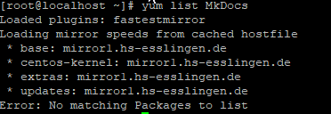
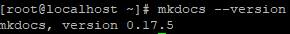
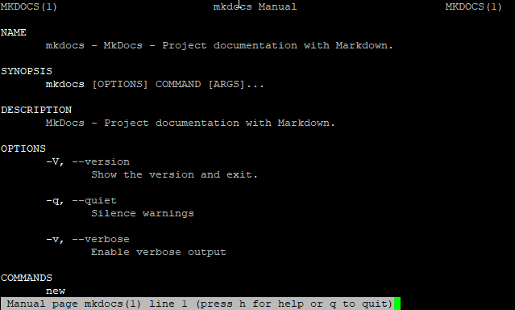
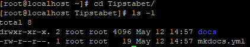
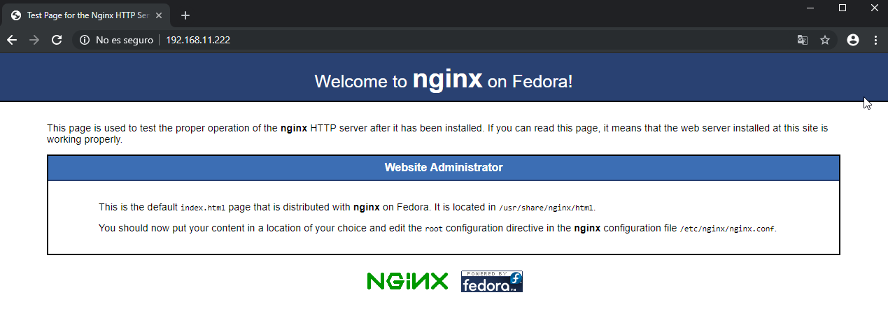

# MkDocs

## ¿Qué es MkDocs?

Tal y como podemos leer en su [web](https://www.mkdocs.org/), es un generador de sitios estáticos orientado a la representación de documentación escrita en formato [Markdown](Markdown.md).

Destaca por ser rápido y simple, ya que la mayor parte de su configuración reside en un único fichero YAML.


## Instalación

Partimos de la base de que tenemos adecuadamente [configurada](../Hardware/Raspberry-Pi.md) nuestra Raspberry Pi para comenzar a trabajar.

Vamos a seguir los pasos de instalación que podemos encontrar en su [web](https://www.mkdocs.org/#installation), aunque posteriormente haremos alguna modificación para adaptarlo a nuestras necesidades. 

Comprobamos si el paquete **MkDocs** se encuentra en los repositorios, para ello ejecutamos el comando `yum list MkDocs`.



Como podemos ver, no se encuentra disponible en los respositorios que tenemos instalados actualmente, por lo tanto realizaremos su instalación manualmente.

#### Proceso de instalación

Comprobamos si los paquete **python** y **pip** se encuentran instalado en nuestro sistema, para ello ejecutaremos los comandos `yum list installed python` y `yum list installed pip`.

El primero de ellos se **encuentra instalado** y en una versión compatible con nuestro sistema (las versiones compatibles son 2.7, 3.4, 3.5, 3.6, 3.7). 

Pip no se encuentra instalado, por lo que vamos a su [web](https://pip.readthedocs.io/en/stable/installing/) para saber como instalarlo. Debemos ejecutar lo siguiente:

````bash
#Descargamos el fichero "get-pip.py" de la web que pasamos a curl
curl https://bootstrap.pypa.io/get-pip.py -o get-pip.py

#Ejecutamos con el intérprete python "get-pip.py"
python get-pip.py
````

Ya tenemos los requisitos necesarios para instalar **MkDocs**, por lo tanto procedemos a su instalación.

````bash
pip install mkdocs
````

Comprobamos la versión instalada.

````bash
mkdocs --version
````



Para terminar generaremos los *manpages* correspondientes a MkDocs.

````bash
#Instalamos "click-man"
pip install click-man

#Generamos el manpage de mkdocs
click-man --target /usr/share/man/man1 mkdocs

#Actualizamos la base de datos de manpages
mandb
````




## Generando un nuevo proyecto

En primer lugar, debemos crear un nuevo proyecto, donde se almacenarán todos los documentos que se incluirán dentro de la web estática que generaremos con MkDocs.

````bash
#Generando el proyecto Tipstabet
mkdocs new Tipstabet
````



En este momento, dentro del directorio Tipstabet nos encontramos con un directorio llamado `docs` que contendrá toda la documentación que se mostrará desde el navegador, y un fichero llamado `mkdocs.yml`, que es el fichero de configuración, en el cual realizaremos algunas modificaciones.

Si queremos realizar pruebas, disponemos del comando **`mkdocs serve`**, nos permite previsualizar desde el navegador donde se encuentra instalado **MkDocs** e introduciendo la dirección **`127.0.0.1:8000`** la web estática con nuestra documentación.

En nuestra Raspberry Pi no disponemos de entorno gráfico, por lo que por el momento no podremos previsualizar los cambios que vayamos realizando. 


## Configurando MkDocs

### Docs

Antes de poder generar nuestro sitio web estático con toda la documentación será necesario que esa documentación se encuentre en `/root/Tipstabet/docs`. Para que todo el contenido se mantenga sincronizado con las modificaciones que se realizan se han utilizado varias herramientas.

- **[Typora](https://typora.io/)**: todo el contenido se ha generado con la sintaxis **markdown**. Hay multitud de editores multiplataforma, pero hemos elegido este por ser gratuito, minimalista y porque se encuentra disponible en las principales plataformas orientadas a pc.


- **Google Drive**: desde nuestro centro de estudios nos han facilitado una cuenta educativa de google que nos da acceso a la suite de google. Esto nos permite tener almacenamiento ilimtado en Google Drive. Es una forma de tener disponible todo el contenido en todo momento.


- **[Rclone](../Herramientas/Rclone.md)**: herramienta utilizada para sincronizar la documentación que tenemos en Google Drive con nuestro [NAS](../Hardware/Rockstor.md). El NAS será el dispositivo que compartirá toda la documentación con la Raspberry Pi para después poder generar el contenido.


- **[Syncthing](../Herramientas/Docker/Syncthing.md)**: se trata de una herramienta de sincronización descentralizada, similar a las redes p2p, que nos permitirá tener en un equipo Windows de los utilizados por el proyecto, toda la documentación sincronizada.


### Mkdocs.yml

Es una de las partes fundamentales para configurar nuestra web estática a nuestro gusto o necesidades. Cuando ejecutamos el comando `mkdocs build`, pasa el fichero `mkdocs.yml` para establecer los parámetros indicados. El fichero que hemos generado se encuentra en este [enlace](../Recursos/Lenguaje-de-marcas/mkdocs.yml), no obstante a continuación se muestra una copia exacta del mismo.

````yaml
#Información sobre el proyecto
site_name: TipsTaBet
site_author: ASIR 1

#Copyright
copyright: "Copyright &copy; 2019 ASIR 1"

#Información sobre el repositorio
repo_name: 'tzinm/Tipstabet'
repo_url: 'https://github.com/tzinm/Tipstabet'

#Suprimir el icono de edición (https://www.mkdocs.org/user-guide/configuration/#edit_uri)
edit_uri: ''

#Tema utilizado, con configuraciones específicas, por ejemplo los lenguajes que interpretará para mostrar adecuadamente en las "cajas" de código.
theme:
 name: 'material'
 language: 'es'
 palette:
   primary: 'indigo'
   accent: 'indigo'
 feature:
   tabs: true
 favicon: ./Imagenes/favicon.ico
 logo:
   icon: 'devices_other'
 highlightjs: true
 hljs_languages:
  - bash
  - powershell
  - markdown
  - yaml

#Contenido extra
extra:
  social:
    - type: 'github'
      link: 'https://github.com/tzinm'
    - type: 'twitter'
      link: 'https://twitter.com/tzinm1'

#Extensiones que añaden funciones extra, como por ejemplo links permanentes a los encabezados de diferentes niveles.
markdown_extensions:
 - codehilite:
     linenums: true
 - toc:
    permalink: true
    permalink: "#"
 - admonition
 - footnotes

#Índice del contenido, nos permite organizarlo como deseemos
pages:
- Home: 'index.md'
- Hardware:
  - Fichas técnicas: ./Hardware/Fichas-tecnicas.md
  - Rockstor: ./Hardware/Rockstor.md
  - Raspberry Pi: ./Hardware/Raspberry-Pi.md
  - Presupuesto Servidor: ./Hardware/Servidor.md
  - Control de acceso: ./Hardware/Log.md
  - Proyecto Celulosa: ./Hardware/Proyecto-Celulosa.md
- Sistemas Operativos:
  - Comandos de Administración: ./Sistemas-Operativos/Comandos-de-Administracion.md
  - Punto de restauración: ./Sistemas-Operativos/Equipos-Clientes/Punto-de-Restauracion.md
  - Imagen del Sistema: ./Sistemas-Operativos/Equipos-Clientes/Imagenes-del-Sistema.md
  - Acceso Remoto: ./Sistemas-Operativos/Equipos-Clientes/Acceso-Remoto.md
  - Unir Linux a Windows Server: ./Sistemas-Operativos/Equipos-Clientes/Dominio-linux.md
- Administración de redes:
  - Planificación de la red: ./Planificacion-Administracion-de-Redes/Red.md
- Lenguaje de Marcas:
  - Servidor Web: ./Lenguaje-de-Marcas/Tipstabet.md
  - MkDocs: ./Lenguaje-de-Marcas/MkDocs.md
  - Markdown: ./Lenguaje-de-Marcas/Markdown.md
- Contenido extra:
  - Easy2boot: ./Herramientas/Easy2boot.md
  - Rclone: ./Herramientas/Rclone.md
- Incidencias:
  - Restaurar contraseña WS: ./Incidencias/30-04-2019.md
````

!!!note
    Es importante respetar la sintaxix "yaml" para que la generación de la web con toda la documentación se realice correctamente.

Durante el proyecto de clase se ha utilizado el tema [Read the Docs](https://www.mkdocs.org/user-guide/deploying-your-docs/#read-the-docs) que está incluido dentro de la herramienta MkDocs. Para la publicación de toda la documentación se ha utilizado la plataforma [GitHub](https://github.com) y el tema [Material for MkDocs](https://squidfunk.github.io/mkdocs-material/). En el apartado [Deployment with GitHub](../Herramientas/Github.md) se encuentra explicado de forma más detallada este proceso.


## Nginx como servidor web

MkDocs nos brinda diferentes posibilidades para servir el contenido generado por `mkdocs`, hemos optados por utilizar la propia Raspberry Pi como servidor web, el cual utilizaremos para que todo el contenido generado sea accesible. 

El servidor web que utilizaremos para este proyecto será **Nginx**, debido a las **[ventajas](https://raiolanetworks.es/blog/nginx/)** que proporciona sobre Apache, sobre todo en dispositivos de bajo rendimiento. Para poder instalar Nginx es necesario añadir los repositorios epel-release (Extra Packages for Enterprise Linux).

En [este enlace](https://wiki.centos.org/SpecialInterestGroup/AltArch/armhfp?action=show&redirect=SpecialInterestGroup%2FAltArch%2FArm32#head-2c416cfaecdf675f43a5be7a81ad50e81e640c93) podemos ver como añadir estos repositorios en la versión de CentOS para Raspberry Pi.

````bash
cat > /etc/yum.repos.d/epel.repo << EOF
[epel]
name=Epel rebuild for armhfp
baseurl=https://armv7.dev.centos.org/repodir/epel-pass-1/
enabled=1
gpgcheck=0

EOF
````

Actualizamos ejecutando `yum update` y dispondremos del paquete **Nginx** para su descarga. Instalamos Nginx:

````bash
yum install Nginx
````

Iniciamos Nginx:

````bash
systemctl start nginx
````

Habilitamos Nginx para que se inicie con el sistema operativo:

````bash
systemctl enable nginx
````

Recordamos que ya hemos habilitado el [firewall](../Hardware/Raspberry pi.md/#Firewall) para que el servidor web pueda recibir peticiones.



Si revisamos el fichero de configuración del servidor **Nginx** podemos observar que el directorio root es `/usr/share/nginx/html`, por lo tanto, todo lo que queramos que sea accesible desde un navegador debe incorporarse a este directorio. 

En el caso que queramos servir varias páginas web existen diferentes opciones, en este caso hemos configurado [**directorios virtuales**](Tipstabet.md) en el servidor web.

El contenido que generamos con el comando `mkdocs build` se almacena en el directorio **site** dentro del directorio que hemos creado para nuestro proyecto, es decir `/root/Tipstabet/site`.

Es muy probable que deseemos realizar modificaciones, ya sea porque hemos añadido contenido nuevo, o porque hemos modificado el contenido existente. Para ello hemos creado un pequeño [script](../Recursos/Lenguaje-de-marcas/mkdocs-build.sh) que nos realizará todo el proceso.

````bash
#!/bin/bash
#Nos posicionamos en el directorio del proyecto
cd /root/Tipstabet

#Generamos el "site" con el comando mkdocs
mkdocs build

#Copiamos el contenido generado a la ruta correspondiente
yes | cp -rf /root/Tipstabet/site/* /usr/share/nginx/html/documentacion
````

- [Man cp](https://linux.die.net/man/1/cp)
- [Man yes](https://linux.die.net/man/1/yes)


----


