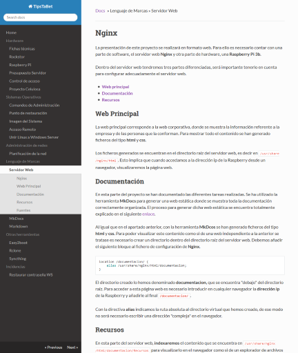
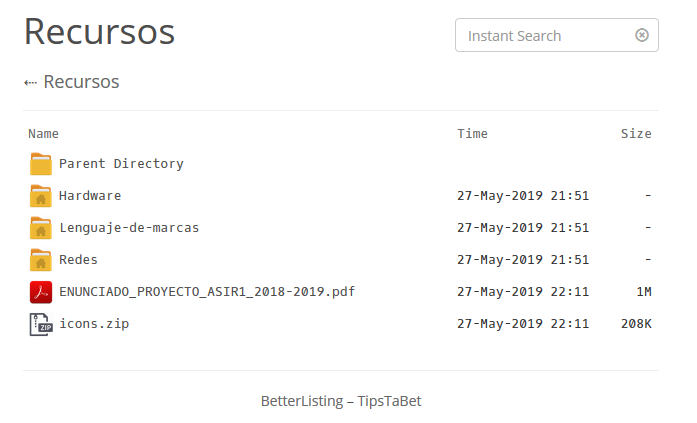
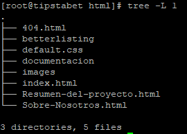

# Nginx

La presentación de este proyecto se realizará en formato web. Para ello es necesario contar con una parte de software,  el servidor web **Nginx** y otra parte de hardware, una **Raspberry Pi 3b**.

Dentro del servidor web tendremos tres partes diferenciadas, será importante tenerlo en cuenta para configurar adecuadamente el servidor web.

- **[Web principal](#web-principal)**
- **[Documentación](#documentacion)**
- **[Recursos](#recursos)**


## Web Principal

La web principal corresponde a la web corporativa, donde se muestra la información referente a la empresa y de las personas que la conforman. Para mostrar todo el contenido se han generado ficheros del tipo **html** y **css**.

Los ficheros generados se encuentran en el directorio raíz del servidor web, es decir en `/usr/share/nginx/html`. Esto implica que cuando accedamos a la dirección ip de la Raspberry desde un navegador, visualizaremos la página web.


## Documentación 

En esta parte del proyecto se han documentado las diferentes tareas realizadas. Se ha utilizado la herramienta **MkDocs** para generar una web estática donde se muestra toda la documentación correctamente organizada. El proceso para generar dicha web estática se encuentra totalmente explicado en el siguiente [enlace](MkDocs.md).

Al igual que en el apartado anterior, con la herramienta **MkDcos** se han generado ficheros del tipo **html** y **css**. Para poder visualizar este contenido como si de una web independiente a la anterior se tratase es necesario crear un directorio dentro del directorio raíz del servidor web. Debemos añadir el siguiente bloque al fichero de configuración de **Nginx**.

````
location /documentacion/ {
	alias /usr/share/nginx/html/documentacion;
}
````

El directorio creado lo hemos denominado **documentacion**, que se encuentra "debajo" del directorio raíz. Para acceder a esta página web es necesario introducir en cualquier navegador la **dirección ip** de la Raspberry y añadirle al final **`/documentacion/`**.

Con la directiva **alias** indicamos la ruta absoluta al directorio virtual que hemos creado, de ese modo no será necesario escribir una dirección "compleja" en el navegador.





## Recursos

En esta parte del servidor web, **indexaremos** el contenido que se encuentra en `/usr/share/nginx/html/documentacion/Recursos` para visualizarlo en el navegador como si de un explorador de archivos se tratase. Se ha añadido al fichero de configuración de Nginx el siguiente bloque:

````
location /Recursos/ {
	alias /usr/share/nginx/html/documentacion/Recursos/;
	add_before_body /betterlisting/top.html;
	add_after_body /betterlisting/bot.html;
	autoindex on;
	autoindex_localtime on;
	autoindex_exact_size off;
}	
````

Para que el navegador muestre el contenido de un directorio, únicamente es necesario establecer la directiva **autoindex**. Por defecto, la forma en la que se muestra el contenido no es visualmente atractiva, por lo que para darle un aspecto más agradable hemos utilizado el proyecto  **betterlisting** que podemos encontrar en [gitlab](https://gitlab.com/devCoster/BetterListing/tree/master/).

Hay varias directivas que no se había visto hasta el momento que explicaremos a continuación:

- **autoindex_exact_size off:** por defecto esta directiva se encuentra activa. Si la desactivamos nos muestra el tamaño de los ficheros redondeado en KB, MB o GB.
- **add_before_body:** nos permite añadir contenido antes de cargar el body[^1] de la solicitud (el contenido a indexar).
- **add_after_body**: a diferencia de la directiva anterior añade contenido después de cargar el body[^1].

Con la dos directivas anteriores conseguimos cambiar el aspecto en el navegador cuando visualizamos el contenido indexado. En estas directivas indicamos la ruta donde se encuentra el contenido añadido de  **betterlisting**. 

Soporta diferentes tipos de ficheros, que podemos encontrar [aquí](https://gitlab.com/devCoster/BetterListing/tree/master/#features). Si queremos añadir soporte a nuevos tipos de ficheros, simplemente modificamos el fichero **top.html**, y añadimos el icono con el mismo nombre que el tipo de fichero al directorio **icons**.




!!!note
    Si tuviésemos ficheros de diferente índole, y queremos seleccionar cuales son los que el servidor Nginx debe indexar, podríamos hacer uso del modulo [Fancy Index](https://www.nginx.com/resources/wiki/modules/fancy_index/), que nos permite con expresiones regulares seleccionar el contenido a indexar[^2].

Para terminar, en la siguiente imagen podemos ver como se encuentra organizado el directorio `/usr/share/nginx/html`.



## Fuentes

[Creating Virtual Directory Apache](http://w3shaman.com/article/creating-virtual-directory-apache)

[Nginx Beginners Guide](https://nginx.org/en/docs/beginners_guide.html)

[Nginxconfig.io](https://nginxconfig.io/?wordpress)

[Apaxy theme](https://oupala.github.io/apaxy/)

[^1]:El body de la solicitud representa el contenido a indexar.

[^2]: Este modulo no se encuentra disponible para la arquitectura ARM.