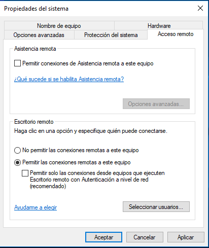

# Acceso remoto

Al igual que en la creación del punto de restauración, debemos ejecutar una vez que se haya abierto la ventana de ejecutar `sysdm.cpl`.

Se abrirá la venta de **"Propiedades del sistema"**, donde deberemos seleccionar la pestaña de acceso remoto. En la parte inferior deberemos **permitir** las **conexiones remotas**

---

