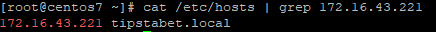
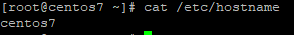
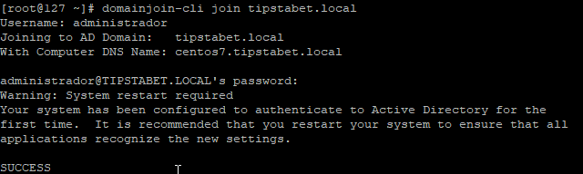
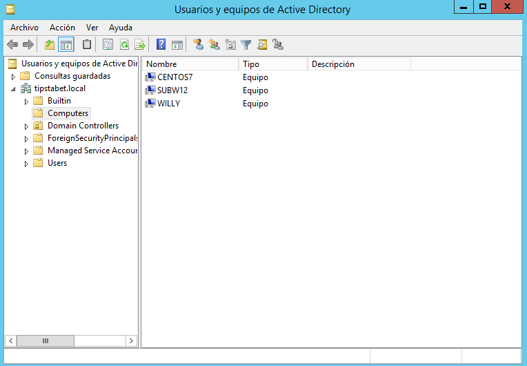

# CentOS en Windows Server 2012

## Configuración máquina CentOS 7

Para llevar a cabo el proceso, utilizaremos la herramienta PowerBroker que nos proporciona la empresa [Beyond trust](https://www.beyondtrust.com/es/). Antes de unir al controlador de dominio la máquina Linux que tenemos, debemos realizar una serie de cambios. 

En primer lugar modificaremos el fichero `/etc/sysconfig/network-script/ifcfg-enp3s0`. El fichero quedará del siguiente modo:

````bash
DEVICE=enp3s0
ONBOOT=yes
BOOTPROTO=static
IPADDR=172.16.43.225
NETMASK=255.255.255.0
GATEWAY=172.16.43.254
DNS1=172.16.43.221 #Dirección IP de Windows Server
DNS2=8.8.8.8
DOMAIN=tipstabet.local #Nombre de dominio de nuestro Windows Server
````

El siguiente paso será deshabilitar **selinux** que podemos encontrarlo en la ruta`/etc/sysconfig/selinux`, tal y como se explicó [aquí](../../Hardware/Raspberry-Pi/#Deshabiitar-selinux).

Continuamos realizando cambios en el fichero `/etc/hosts` y `/etc/hostname`.  En el  primer fichero de los dos debemos añadir una línea con la **dirección ip** del servidor junto a su **nombre de dominio**.



**¿Por qué debemos modificar el hostname?**

Para poder unir al controlador del dominio mediante la herramienta PowerBroker, es necesario que el nombre de nuestra máquina sea diferente a "linux" o "localhost".

Podemos cambiar el nombre editando el fichero `/etc/hostname` o mediante el comando `hostnamectl`.

- Modificando el fichero:

````bash
vi /etc/hostname
````



- Comando **hostnamectl**:

````bash
#Modificamos el nombre de la máquina
hostnamectl set-hostname centos7 --static

#Reiniciamos el servicio
systemctl restart systemd-hostnamed

#Comprobamos que se ha modificado correctamente
hosntamectl status
````


## Instalación PowerBroker

Para realizar la instalación de PowerBroker hemos seguido la [guía](https://repo.pbis.beyondtrust.com/yum.html) que podemos encontrar en su web.

- **Añadimos los repositorios PBISO**

````bash
sudo wget -O /etc/yum.repos.d/pbiso.repo http://repo.pbis.beyondtrust.com/yum/pbiso.repo 
````

- **Eliminamos la caché de yum**

````bash
yum clean all
````

- **Instalamos "pbis-open"**

````bash
yum install pbis-opne
````


## Añadiendo CentOS7 a Windows Server

Una vez que ya hemos llegado hasta aquí, únicamente nos queda introducir un comando para añadir la máquina nuestro Servidor Windows. El comando a ejecutar es el siguiente:

````bash
domainjoin-cli join tipstabet.local #Si no indicamos usuario nos los solicitará

domainjoin-cli join tipstabet.local administrador
````




Por último, comprobamos en el Servidor de Windows que la máquina se ha unido correctamente al dominio.




## Fuentes

[Unir CentOS7 a Windows Server 2012](https://aprendiendoavirtualizar.com/unir-centos-7-dominio-active-directory/)

[Change hostname CentOS7](<https://www.cyberciti.biz/faq/rhel-redhat-centos-7-change-hostname-command/>)

[Modificar archivos hosts](https://boluda.com/tutorial/modificar-el-archivo-hosts/)

----

