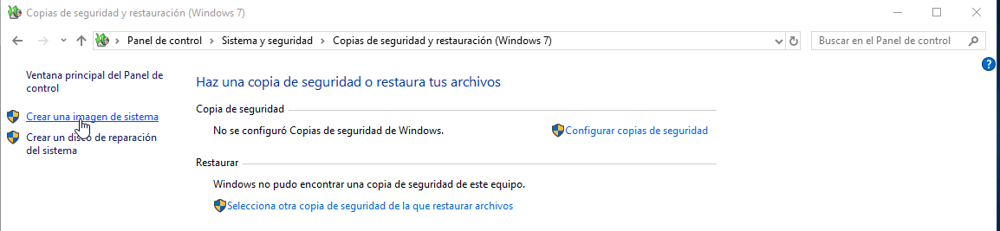
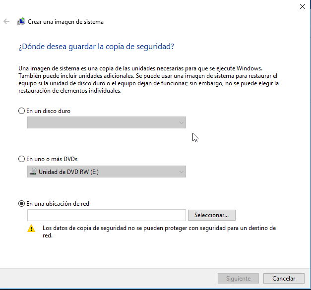
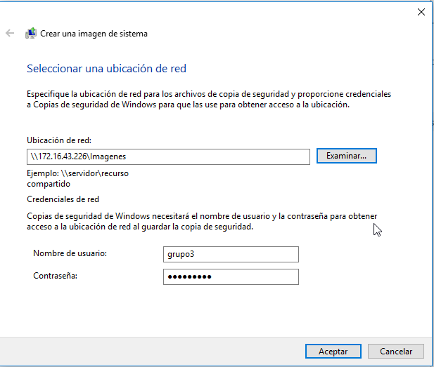
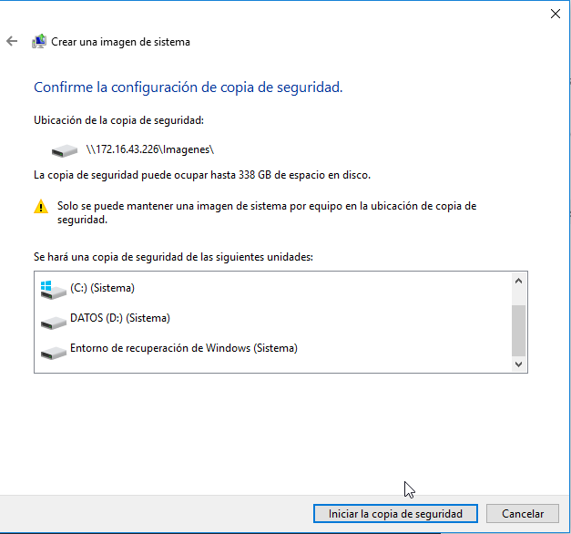

# Imagenes del sistema

Para aprovechar las cualidades del NAS como dispositivo de almacenamiento en red, será el destino de las imágenes del sistema de los diferentes dispositivos. Para ello hemos creado una carpeta compartida ([aquí](../../Hardware/Rockstor.md) podemos encontrar una pequeña guía del proceso necesario a seguir).

Los parámetros más importantes de la captura anterior son los siguientes:

- **Share:** es el directorio que deseamos compartir.
- **Browseable:** listar o no como recurso de red, es decir que para acceder al recurso es necesario conocer la ruta completa.
- **Guest ok:** habilita el acceso a usuario no autenticados.
- **Read only**: permitir la escritura o no.

Una vez que ya tenemos compartido el directorio debemos configurar nuestros equipos Windows para que la imagen que hagamos del sistema se realice en el NAS.

En primer lugar debemos abrir el Panel de control e ir a la ruta Panel de control > Sistema y seguridad > Copias de seguridad y restauración. En el panel lateral que nos aparece, debemos seleccionar **"Crear una imagen de sistema"**.

Abrimos la ventana de configuración, y debemos seguir las siguientes indicaciones:

- Seleccionar ubicación de red como lugar de almacenamiento.

- En la siguiente pantalla debemos completar los datos que nos solicita, tal y como se ve en la siguiente captura.

- Cuando pulsamos *"aceptar"*, Windows realiza una validación de la ubicación de red. Cuando se completa la validación pasamos al resumen de las unidades sobre las que se realizará la imagen del sistema.

Hemos llegado al paso final, dependiendo del tamaño de la copia se demorará en el tiempo, ya que la copia se hace a través de la red y no en un dispositivo conectado directamente al equipo.

------

