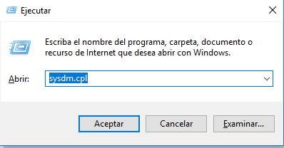
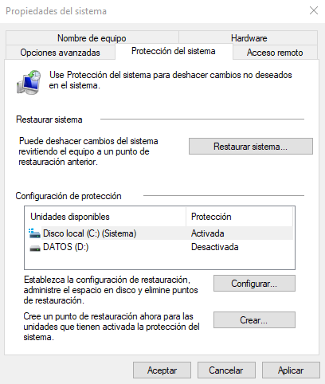
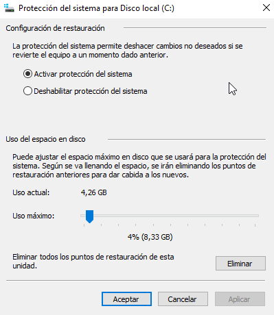
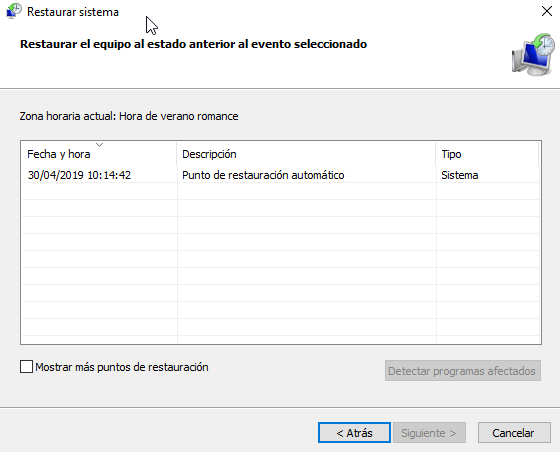

# Punto de Restauración

**¿Cuál es la principal utilidad de los puntos de restauración?**

La utilidad principal es poder recuperar el sistema a un estado anterior, principalmente cuando debido a una actualización o instalación de una aplicación el sistema no funciona correctamente. Este sistema excluye lo referente a los archivos almacenados.

La utilidad de esta herramienta es poder retornar el equipo a un estado anterior, incluyendo el sistema operativo y las aplicaciones instaladas.

En primer lugar abrimos la ventana de *"ejecutar"* pulsando la combinación de telcado `Windows + R`. En la ventana que se abre debemos escribir `sysdm.cpl`para abrir las Propiedades del sistema.

En la ventana de **Propiedades del sistema** debemos seleccionar la pestaña de **Protección del sistema**.

Debemos pulsar el botón de configurar para poder activar y configurar el espacio que usaremos en disco. En nuestro caso la configuración es la siguiente:

Si deseamos restaurar un punto de restauración o consultar los diferentes punto que tenemos creados, debemos abrir la ventana de **Restaurar sistema**.

---

